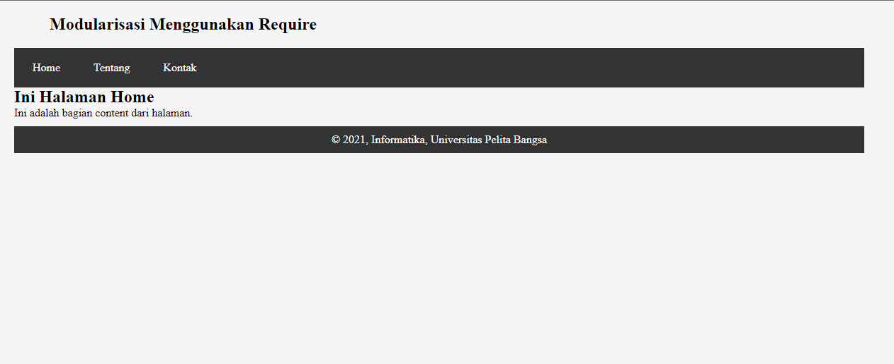
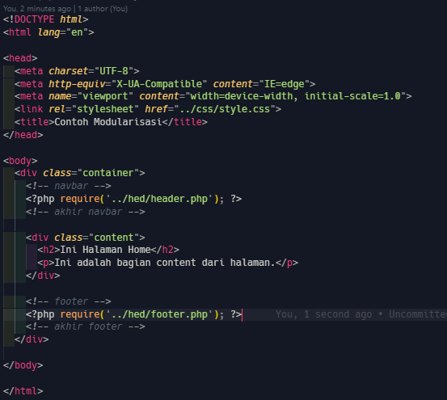
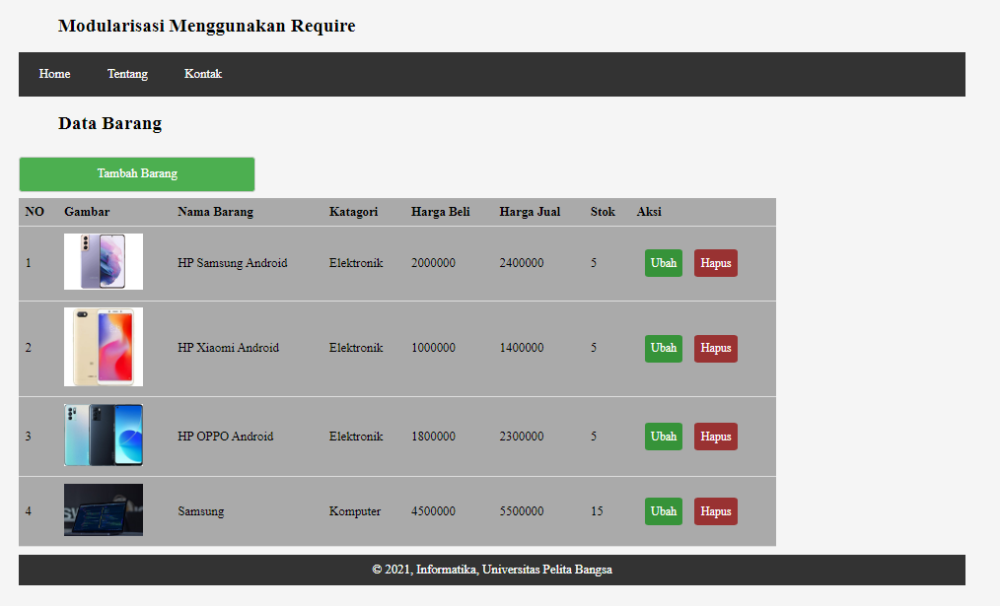
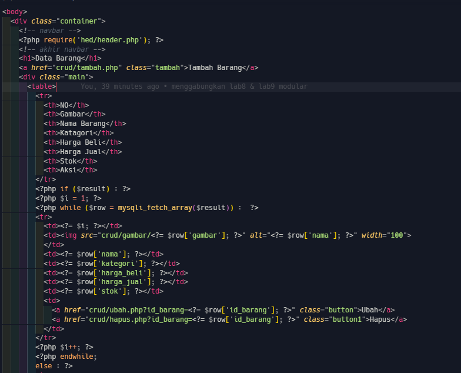
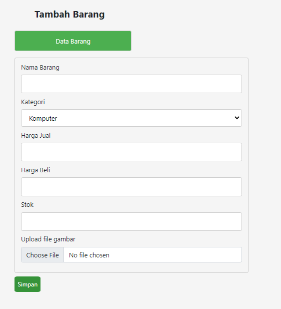
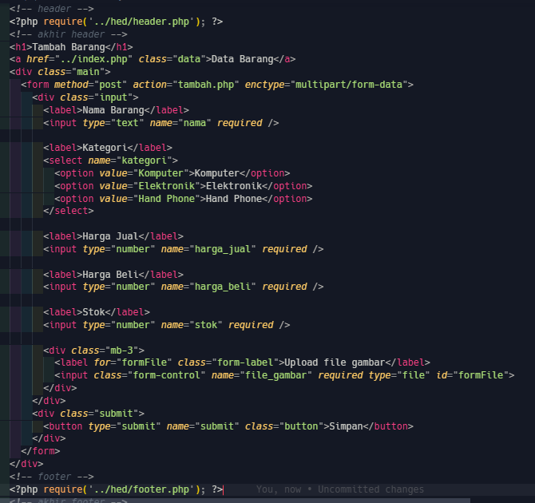
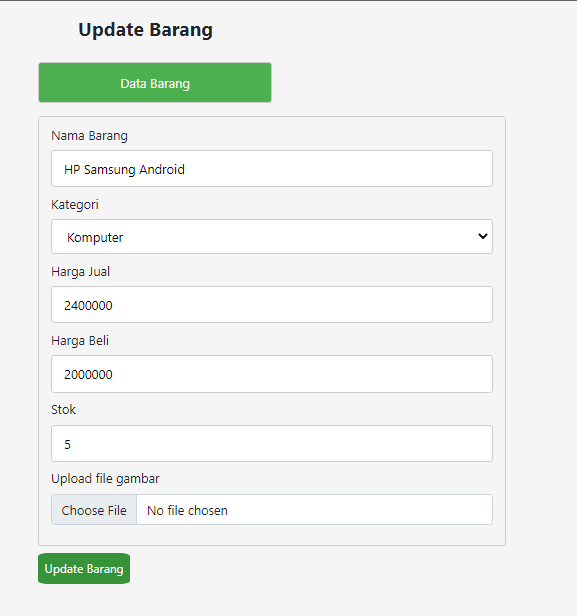
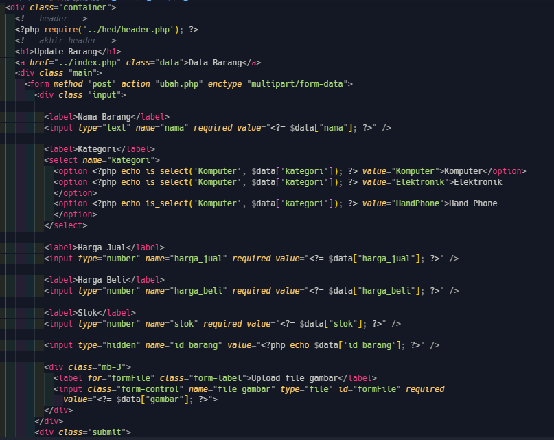

<a href="https://github.com/taufiqalif/Lab10Web" target="_blank"><h3>Lab10Web</h3></a>

## Lab9Web

<a href="https://github.com/taufiqalif/Lab8Web" target="_blank"><h3>Lab8Web</h3></a>

## Mengimplementasikan pada Lab8Web

